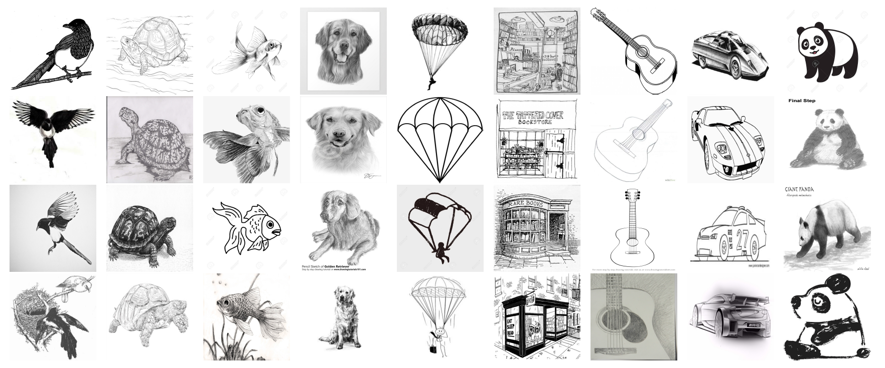

# Imagenet-Sketch Classification Project
- 2024.09.11 ~ 2024.09.26
- 네이버 부스트캠프 기간 중 진행된 비공개 대회


## Dataset

원본 ImageNet Sketch 데이터셋은 50,889개의 이미지 데이터로 구성되어 있으며 1,000개의 객체에 대해 각각 대략 50개씩의 이미지를 가지고 있습니다. 일반적인 객체들의 핸드 드로잉 이미지로 구성되어 있으며, 실제 객체를 대표하는 다양한 스타일과 특징을 보여줍니다. 

이번 경진대회에서 제공되는 데이터셋은 원본데이터를 직접 검수하고 정제하여 1,000개의 클래스에서 정제 후 이미지 수량이 많은 상위 500개의 객체를 선정했으며 총 25,035개의 이미지 데이터가 활용됩니다. 해당 이미지 데이터는 15,021개의 학습데이터와 10,014개의 Private&Public 평가데이터로 나누어 구성되어있다.

## Tools
- Github
- Slack
- VS Code
- Tensorboard

## Experiments


## Installation
1. Install the required Python packages by running the following command:
  <br/>It is highly recommended to use a virtual environment `venv`.
   ```bash
   pip install -r requirements.txt
   ```
2. The imagenet_sketch dataset must be stored in the data folder. To download the dataset, execute following script:
    ```bash
    bash download_sketch_dataset.sh
    ```
## Training
### Config file format
Config files are in `.yaml` format:
```yaml
exp_name: "base_experiment"
seed: 999
traindata_dir: './data/train'
testdata_dir: './data/test'

traindata_info_file: './data/train.csv'
testdata_info_file: './data/test.csv'

train_result_path: './train_result'
test_result_path: './output'

transform:
  transform_type: albumentations # rand_augment, auto_augment
  augmentations:
    - type: HorizontalFlip
      params:
        p: 0.5
    - type: Rotate
      params:
        limit: 30
        p: 0.7
    - type: RandomBrightnessContrast
      params:
        brightness_limit: 0.2
        contrast_limit: 0.2
        p: 0.5

device: 'cuda'

model_type: 'timm'
model_name: 'resnet18'
pretrained: true

loss: 'CELoss'

# lora:
#   use: true
#   params:
#     r: 8
#     lora_alpha: 16
#     lora_dropout: 0.1
#     target_modules: '.*(attn.qkv|attn.proj|mlp.fc\d)'
#     modules_to_save: ["head"]


optimizer:
  type: Adam
  params:
    lr: 0.001

scheduler:
  type: StepLR
  params:
    step_size: 376
    gamma: 0.1

# MPTrainer: true
num_epochs: 5
batch_size: 64

```

Add addional configurations if you need.

### Training with config example
Modify the configurations in `.yaml` config files, then run:

  ```
  python train.py --config ./config/config.yaml
  ```


## Testing
### Test example
  ```
  # Output will be saved in ./{test_result_path}/{exp_name}/
  # valid only
  python test.py --config ./config/config.yaml --valid

  # test only
  python test.py --config ./config/config.yaml --test

  # all
  python test.py --config ./config/config.yaml --all
  ```

### Ensemble test
```
python ./soft_ens.py # test only
```

### Test output
The script will save the results in the `test_result_path` directory (as specified in the config).

- For validation, a summary of correct/incorrect predictions and overall accuracy will be printed, and the results will be saved as:
  - `valid_output.csv`: Full validation results.
  - `valid_incorrect_preds.csv`: Only incorrect predictions.

- For testing, the predictions will be saved in:
  - `test_output.csv`: Predictions for the test data.


## Best Result
Weighted soft ensembling using the following LoRA fine-tuned models and their weights.

For more details, please refer to soft_ens.py
```
- Models:
  caformer_b36.sail_in22k_ft_in1k
  deit3_large_patch16_224.fb_in22k_ft_in1k
  swin_large_patch4_window7_224.ms_in22k_ft_in1k
  dinov2_vitl14_reg_lc
  vit_large_patch14_clip_224.openai_ft_in1k
  beitv2_large_patch16_224.in1k_ft_in22k_in1k

- Weight: [1, 1, 1, 1, 1, 2]

- Accuracy: 93.60%
```

## Sources we referred to and read
- https://koreascience.kr/article/JAKO202421461791112.page
- https://arxiv.org/pdf/1611.05431
- https://arxiv.org/abs/2403.07203
- https://arxiv.org/abs/2407.03893
- https://www.kaggle.com/code/pedropordeus/imagenet-sketch
- https://dacon.io/competitions/official/235697/codeshare/2373
- https://arxiv.org/abs/2206.04548
